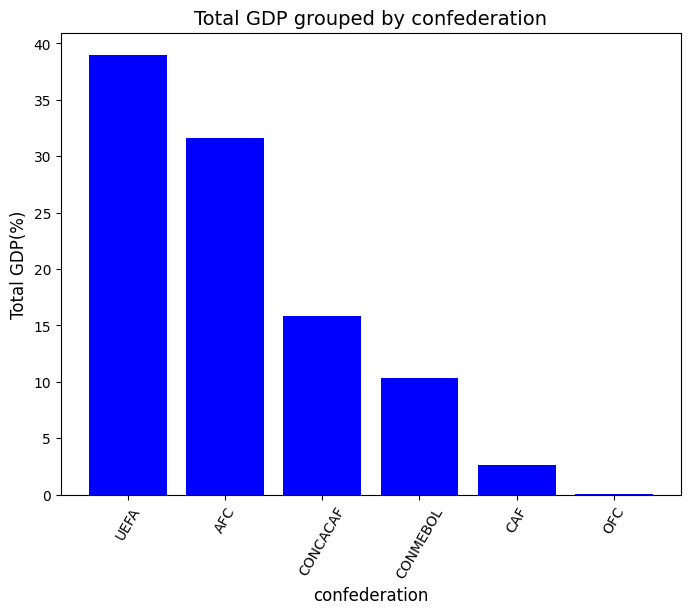
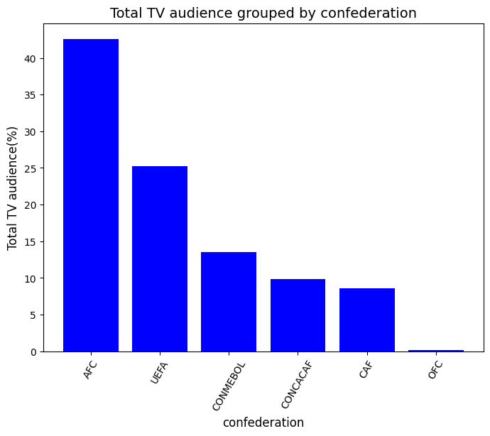
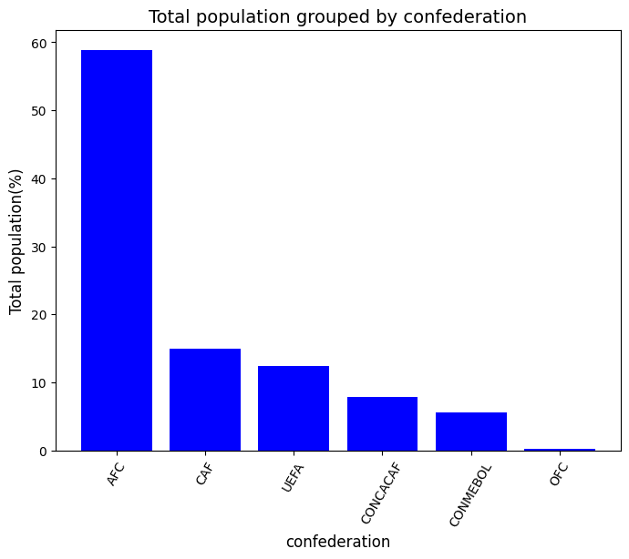
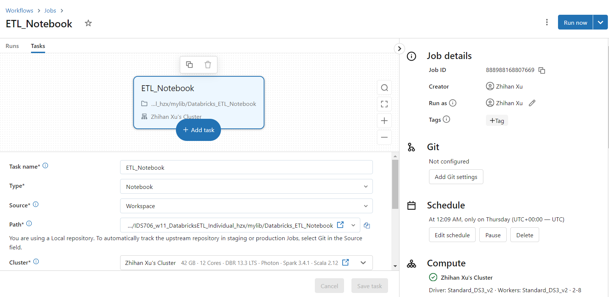
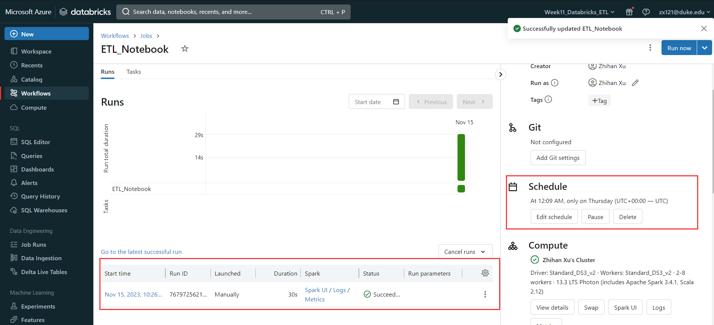

[](https://github.com/nogibjj/python-ruff-template/actions/workflows/cicd.yml)
# Individual Project 3 - Databricks ETL pipeline

[YouTube Link](https://youtu.be/QjkiF9a2NvI)

# Requirements
Your project should include the following:
- A well-documented Databricks notebook that performs ETL (Extract, Transform, Load) operations, checked into the repository.
- Usage of Delta Lake for data storage (show you understand the benefits).
- Usage of Spark SQL for data transformations.
- Proper error handling and data validation.
- Visualization of the transformed data.
- An automated trigger to initiate the pipeline.
- README.md: A file that clearly explains what the project does, its dependencies, how to run the program, and concludes with actionable and data-driven recommendations to a hypothetical management team.
- Video Demo: A YouTube link in README.md showing a clear, concise walkthrough and demonstration of your ETL pipeline, including the automated trigger and recommendations to the management team.

# Preparation
1. Create the Azure databricks workspace and cluster
2. Connect the Github account to the databricks workspace(User settings -> Linked accounts)
3. Set up the environment variables using `Global ini scripts` or `.env` file
    - Configuration for the `SERVER_HOSTNAME` and `ACCESS_TOKEN`
    - Prepare for the Python environments with `requirements.txt`. It performs well in Databricks notebook comparing with python scripts. Therefore, I suggest that you can try the ETL pipeline in notebook instead of separated Python scripts.
4. Clone the Github repo into Databricks worspace
5. Create a job on Databricks to build an ETL pipeline
6. Set the auto trigger - Schedule

**Key files**:
- mylib
    * `extract.py`
    * `transform.py`
    * `query-analyze.py`
    * `Databricks_ETL_Notebook` (Databricks notebook)
* `Databricks_ETL.ipynb`
* `.env` (hidden)

# Key steps
## Data Source
The data file `fifa_countries_audience.csv` includes the following variables:

Header | Definition
---|---------
`country` | FIFA member country
`confederation` | Confederation to which country belongs
`population_share` | Country's share of global population (percentage)
`tv_audience_share` | Country's share of global world cup TV Audience (percentage)
`gdp_weighted_share` | Country's GDP-weighted audience share (percentage)

## Data Extraction
- Utilizes the `requests` library to fetch fifa data from the Github URL.
- Get and stores the data in the Databricks FileSystem(DBFS).
    - You can manually upload the csv data and transform it into a table
    - Or you can use Python scripts with `PySpark` and `Delta` as the following steps

## Data Transformation and Load
In this part, we transform the csv file into a Spark dataframe which is then converted into Delta Lake Table `fifa` and stored in the Databricks environment
+ Creating SparkSession: create `sparksession` in the application name "Read CSV". 

+ Reading CSV Data: loads the CSV data from the specified dataset path in DBFS. 

+ Creating DataFrames and do the data validation checks (remove null values). 

+ Adding Unique IDs: the Spark Dataframe is augmented with a new column named "id", populated with unique IDs generated by `monotonically_increasing_id()`.

+ Writing to Delta Lake Tables: The transformed DataFrame is then written to separate Delta Lake tables (a storage format for big data) named `fifa`.

## Data Query and Vizulization
Utilize Spark SQL for data transformations and prepare the data from Delta table for visualization and analysis.
- Creates a `Spark session` with the application name "Query" and runs a SQL query on Delta Lake table 'fifa'. The query selects and aggregates data for confederation, total_countries, total_tv_audience_share, and total_gdp_weighted_share. It returns the result as a `Spark DataFrame`.
```sql
SELECT
    confederation,
    COUNT(DISTINCT country) AS total_countries,
    SUM(population_share) AS total_population_share,
    SUM(tv_audience_share) AS total_tv_audience_share,
    SUM(gdp_weighted_share) AS total_gdp_weighted_share
FROM
    fifa
GROUP BY
    confederation
ORDER BY
    total_gdp_weighted_share DESC
```





### Conclusion
From the plots above, considering the relative population and audience ratio, we can see that AFC and UEFA are the most enthusiastic fans. They occupied most of the audience market. It presents a certain degree of positive correlation between GDP and TV audience ratio.

## Usage of Delta Lake - unique capabilities
Delta Lake is the optimized storage layer that provides the foundation for storing data and tables in the Databricks lakehouse. Delta Lake is open source software that extends Parquet data files with a file-based transaction log for ACID transactions and scalable metadata handling. Delta Lake is fully compatible with Apache Spark APIs, and was developed for tight integration with Structured Streaming, allowing you to easily use a single copy of data for both batch and streaming operations and providing incremental processing at scale.

Delta Lake Time Travel is a feature of Delta Lake that allows you to query and restore historical versions of data. This is achieved by executing time travel queries on a Delta Lake table, enabling you to query the state of the table at different points in time and revert to previous versions. Here are some key concepts and usage patterns of Delta Lake Time Travel:

1. **Version Tracking:** Delta Lake uses version control to track changes to a table. Each modification to a Delta table creates a new version, including operations like inserts, updates, deletes, and more.

2. **Time Travel Queries:** By using the time travel query syntax provided by Delta Lake, you can query a table at a specific timestamp or version. Time travel queries use the `AS OF` or `VERSION AS OF` clauses, for example:

    ```sql
    SELECT * FROM table_name AS OF TIMESTAMP 'timestamp'
    ```

    or

    ```sql
    SELECT * FROM table_name VERSION AS OF version_number
    ```
3. **Rolling Back to Historical Versions:** Through time travel queries, you can selectively roll back the state of a table to previous versions. This can be achieved by creating a new Delta table and then inserting historical version data into the new table.

    ```sql
    -- Create a new table
    CREATE TABLE new_table_name (columns data types);

    -- Insert historical version data
    INSERT INTO new_table_name SELECT * FROM table_name VERSION AS OF version_number;
    ```


## Databricks ETL pipeline

I integrated the whole process from extract -> transform and load -> query and visualization into a Databricks notebook, and then deployed it as a Job in Workflow. I also set the trigger for the job by assigning the **Schedule tab**




# References
1. https://docs.databricks.com/en/dbfs/filestore.html
2. https://docs.databricks.com/en/getting-started/data-pipeline-get-started.html
3. https://learn.microsoft.com/en-us/training/paths/data-engineer-azure-databricks/
4. https://learn.microsoft.com/en-us/azure/databricks/delta/


